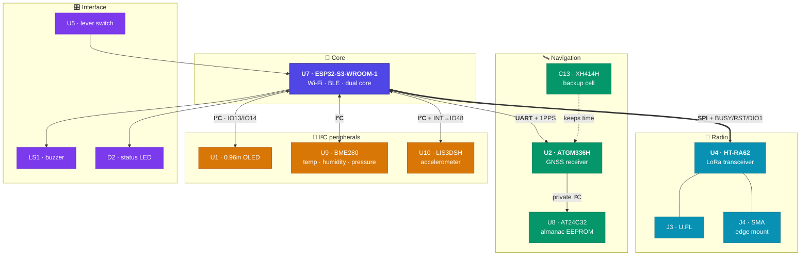
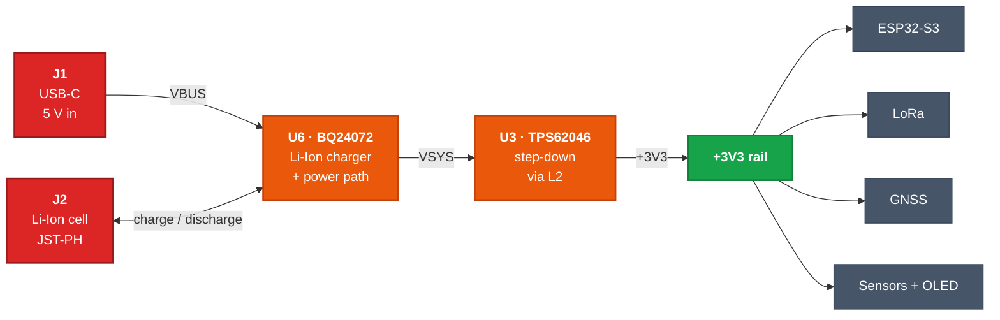

# meshthingy v0

> An off-grid LoRa mesh communicator — a pocket-sized ESP32-S3 node that sends
> text and GPS position over kilometres of open ground, with no cell tower, no
> SIM, no subscription, and no internet.

<sub>KiCad 10 · 2-layer · 71 × 46 mm · ESP32-S3 + SX1262-class LoRa · USB-C · Li-Ion</sub>

---

## What this board is for

Phones stop working the moment you leave coverage. **meshthingy** doesn't need
coverage — it *is* the network.

Each board is one node in a self-healing [Meshtastic](https://meshtastic.org)
mesh. Nodes talk directly to each other over licence-free LoRa radio, and every
node automatically relays traffic for its neighbours. Two units give you a
private long-range walkie-talkie for text; a handful scattered across a valley,
a campsite, a ridgeline, or a city block give everyone in that area a shared
messaging network that keeps working when nothing else does.

Because LoRa trades bandwidth for range and power, a node runs for **days** on a
small Li-Ion cell and reaches **several kilometres** line-of-sight — far past
Wi-Fi or Bluetooth, and without the power budget a cellular radio demands.

Typical uses: hiking and backcountry trips, sailing, off-road convoys, festival
and event crews, neighbourhood emergency preparedness, and as a low-cost
long-range telemetry link for remote sensors.

The onboard GPS, environmental and motion sensors mean a node is useful even
with nobody holding it — drop one on a hilltop as a solar-powered repeater and
it becomes a weather station that also extends everyone's range.

## Features

- **ESP32-S3-WROOM-1** — dual-core MCU with Wi-Fi and Bluetooth LE for phone pairing
- **HT-RA62 LoRa module** — long-range sub-GHz radio, U.FL *and* SMA edge-mount antenna options
- **ATGM336H GNSS** — position reporting, with a rechargeable backup cell for warm starts
- **0.96" OLED** — read messages without a phone
- **BME280** — temperature, humidity, barometric pressure
- **LIS3DSH accelerometer** — wake-on-motion and orientation, with interrupt to the MCU
- **USB-C charging** — BQ24072 Li-Ion charger with power-path, so it runs while charging
- **JST-PH battery connector** — standard single-cell Li-Ion / LiPo
- **Buzzer, status LED, and a side lever switch** for headless operation
- **Test points** on every bus for bring-up and debugging

## System architecture



## Power path

USB-C and the battery both feed a power-path charger, so the node keeps running
while it charges and switches over seamlessly when USB is unplugged.



## Board

| | |
| --- | --- |
| **Dimensions** | 71.00 × 46.00 mm, 1.0 mm corner radius |
| **Stackup** | 2 layers (F.Cu / B.Cu), 1.6 mm |
| **Components** | 88 footprints, 342 pads, 371 vias |
| **Copper** | GND pour on both layers, with keepout zones under the antennas |
| **Design rules** | 0.175 mm clearance, 0.2 mm minimum track, 0.6 / 0.3 mm vias |
| **Assembly** | All SMD, 0805 passives — hand-solderable |

Everything routes on two layers, which keeps this a cheap board to order from any
prototype fab at standard tolerances.

## Pin map

| Function | ESP32-S3 pin | Goes to |
| --- | --- | --- |
| LoRa SCK | TXD0 / GPIO43 | `U4` pin 12 |
| LoRa data | IO1, IO2 | `U4` pins 13, 14 |
| LoRa CS | IO6 | `U4` NSS |
| LoRa DIO1 | IO4 | `U4` interrupt |
| LoRa RESET | IO5 | `U4` reset |
| LoRa BUSY | RXD0 / GPIO44 | `U4` pin 10 |
| GPS TX → MCU | IO42 | `U2` TXD |
| GPS RX ← MCU | IO41 | `U2` RXD |
| GPS 1PPS | IO40 | `U2` timing pulse |
| GPS RESET / enable | IO38, IO39 | `U2` |
| I²C SDA / SCL | IO13 / IO14 | OLED, BME280, LIS3DSH |
| Accelerometer INT | IO48 | `U10` INT1 |

## Schematic layout

The design is hierarchical — root sheet [meshtastic-v0.kicad_sch](meshtastic-v0.kicad_sch):

| Sheet | Contents |
| --- | --- |
| [Power Management](Power%20Management.kicad_sch) | BQ24072 charger, TPS62046 buck, load switching |
| [Microcontroller](Microcontroller.kicad_sch) | ESP32-S3-WROOM-1 and support |
| [LORA](LORA.kicad_sch) | HT-RA62 module, U.FL and SMA antenna paths |
| [GPS](GPS.kicad_sch) | ATGM336H, AT24C32 EEPROM, backup cell |
| [Display](Display.kicad_sch) | 0.96" OLED and its pinout-select jumpers |
| [Air Sensors](Air%20Sensors.kicad_sch) | BME280 |
| [Accelerometer](Accelerometer.kicad_sch) | LIS3DSH |
| [Peripherals](Peripherals.kicad_sch) | EEPROM, buzzer, LED, buttons |
| [Connectors](Connectors.kicad_sch) | USB-C receptacle, JST-PH battery |

## Building it

Open [meshtastic-v0.kicad_pro](meshtastic-v0.kicad_pro) in **KiCad 10** or newer.
All custom symbols and footprints live in [libs/](libs/) and are referenced through
`${KIPRJMOD}`, so the project is self-contained — clone and open, nothing else to install.

Generate fabrication files from the command line:

```bash
# Gerbers + drill, ready to zip and upload to a fab
kicad-cli pcb export gerbers --output fab/ meshtastic-v0.kicad_pcb
kicad-cli pcb export drill   --output fab/ meshtastic-v0.kicad_pcb

# Bill of materials and pick-and-place
kicad-cli sch export bom       --output bom.csv meshtastic-v0.kicad_sch
kicad-cli pcb export pos       --output pos.csv meshtastic-v0.kicad_pcb

# 3D render
kicad-cli pcb render --output board.png meshtastic-v0.kicad_pcb
```

Generated outputs are gitignored — regenerate them, or attach them to a release tag.

### Assembly note

`JP3` and `JP4` are three-way solder jumpers that select which OLED pin gets
`+3V3` and which gets `GND`, so the footprint accepts display modules with either
pinout. They ship **unbridged** — bridge them to match the module you source
before expecting the display to light up. `JP1` and `JP2` are two-way jumpers,
also unbridged.

## Firmware

The board targets [Meshtastic](https://meshtastic.org) firmware on the ESP32-S3.
Peripheral pin assignments follow the map above; the ESP32-S3 GPIO matrix means
bus pins are remappable in firmware if a variant config needs to differ.

## Repository notes

`.history/` is KiCad 10's Local History — a separate nested git repository of
autosaves. It is gitignored and should stay that way. Delete it freely if you
don't need the local undo history.

---

<sub>Meshtastic® is a registered trademark of Meshtastic LLC. This is an
independent hardware design and is not affiliated with or endorsed by Meshtastic LLC.</sub>
